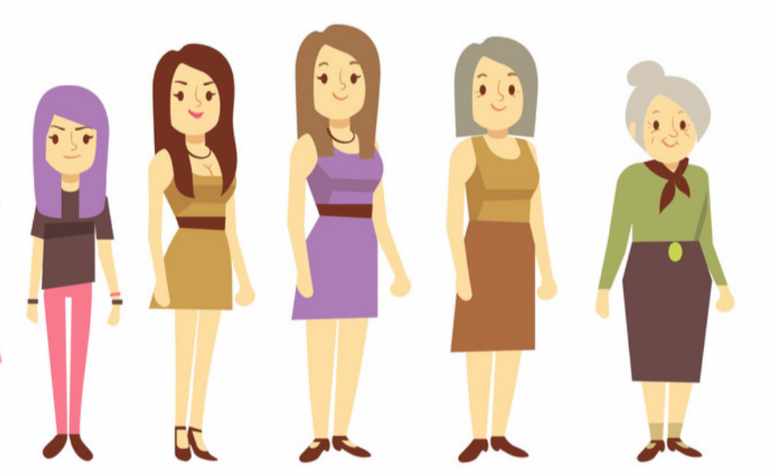

# Applied Data Science @ Columbia
## Fall 2018
## Project 1: What made you happy today?



### [Project Description](doc/)
This is the first and only *individual* (as opposed to *team*) this semester. 

Term: Fall 2018

+ Projec title: How people’s writing habits and happiness change with age
+ This project is conducted by Yunsheng Ma

+ Project summary: According to American institute of human development, there are four significant life stages in one’s life time: Adolescence (Ages 12-20),Early Adulthood (Ages 20-35),Midlife (Ages 35-50) and Mature Adulthood (Ages 50-80). As people become older and move across life stages, they will show different characteristics. In this project, we use a corpus of 100,000 crowd-sourced happy moments and apply natural language processing to find out how people’s writing habits and happiness get changed as they move across life stages. The organization of this report is as follows. Part2 explores the distribution of sentence’s length for each age group,Part3 explores which terms having high frequecy to appear in people’s words about happiness. Part4 use both td-idf and Latent Dirichlet allocation methods to explore what are the differnces in happiness among different age groups.

Following [suggestions](http://nicercode.github.io/blog/2013-04-05-projects/) by [RICH FITZJOHN](http://nicercode.github.io/about/#Team) (@richfitz). This folder is orgarnized as follows.

```
proj/
├── lib/
├── data/
├── doc/
├── figs/
└── output/
```

Please see each subfolder for a README file.
